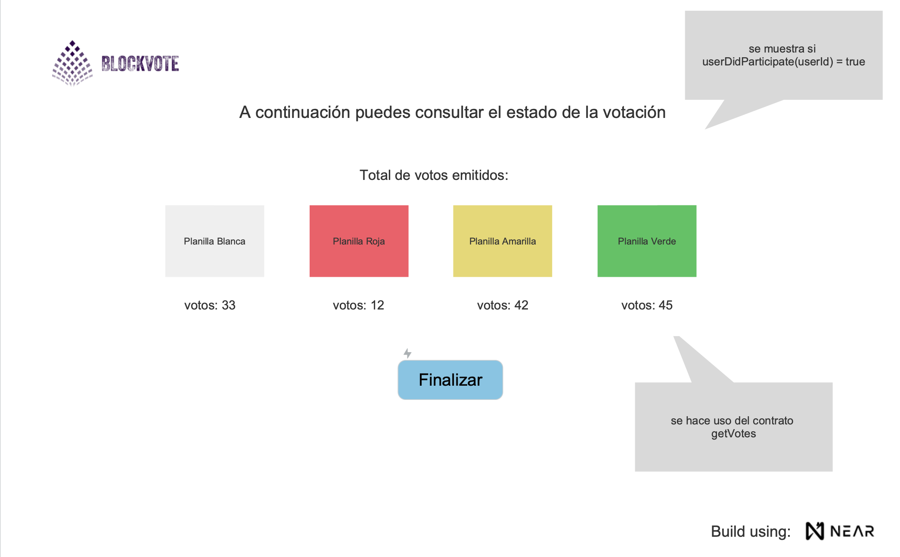

# Blockvote - DApp

[Contrato Inteligente] escrito en [AssemblyScript] para un sistema de votación online usando blockchain.

El objetivo de esta aplicación es crear un sistema de votación simple y seguro. Se usa NEAR como protocolo de blockchain.

## Prototipo

Puedes acceder al prototipo de la aplicacion en el este [enlace](https://www.justinmind.com/usernote/tests/68299055/68314322/68314380/index.html), o descara la aplicación [justinmind] y abre en ella el archivo blockVote.vp de este repositorio.

<p align="center">
  
</p>

## Istalación

- Clona este repo, antes de compilar el código, necesitarás instalar [Node.js] ≥ 12
- Instalar yarn vía npm: `npm install --global yarn`.
- Ejecuta `yarn` desde el directorio raiz del repo de la aplicación.

## Contratos inteligentes

para este proyecto desarrollamos 4 contratos inteligentes para satisacer la logica de negocio, el código se encuentra en `../assembly/index.ts`. Los contratos son:

1. incrementVotes : incrementa el voto de un usuario
2. getVotes : obtiene el voto de un usuario
3. recordUser : registra un usuario
4. userDidParticipate : verifica si un usuario ya votó

## Ejecutando las pruebas ⚙️

1. Tests: El código de pruebas se encuentra en `../assembly/__tests__/main.spec.ts`.
2. Primero compila el paquete usando `yarn asb`.
3. Después ejecuta `yarn test` para correr los tests. Esto corre las pruebas estándar de AssemblyScript tests usando [as-pect].

### Analizando las pruebas 🔩

1. Se verifica primero que nadie haya votando por la 'Planilla Verde'.
2. Se extrae la cantidad de votos de 'Planilla Verde' y se aumentan los votos en una unidad.
3. Se verifica que el usuario 'Juan' ya ha votado o no.

## Despliegue 📦

1. Desde la raíz del proyecto, deployar el paquete con `near dev-deploy build/release/votescontract.wasm`.
2. Copiar el accountIdy sustituirlo en los siguientes comandos para probar el funcionamiento de los contratos.

```bash
near call <accountId> incrementVotes '{"candidate":"amlo"}' --account-id <accountId>
near view <accountId> getVotes '{"candidate":"amlo"}' --account-id <accountId>
near call <accountId> recordUser '{"user":"jorge"}' --account-id <accountId>
near view <accountId> userDidParticipate '{"user":"jorge"}' --account-id <accountId>
```

## Autores ✒️

- [Armando del Río](https://www.linkedin.com/in/adrio1992/)
- [Luis Yañez](https://www.linkedin.com/in/jorge-chavarin/)
- [Jorge Chavarín](https://github.com/lyanezca)

[contrato inteligente]: https://docs.near.org/docs/develop/contracts/overview
[assemblyscript]: https://www.assemblyscript.org/
[node.js]: https://nodejs.org/en/download/package-manager/
[as-pect]: https://www.npmjs.com/package/@as-pect/cli
[justinmind]: https://www.justinmind.com/usernote/tests/68299055/68299921/68299923/index.html
[yarn documentation]: https://classic.yarnpkg.com/lang/en/docs/install/#windows-stable
